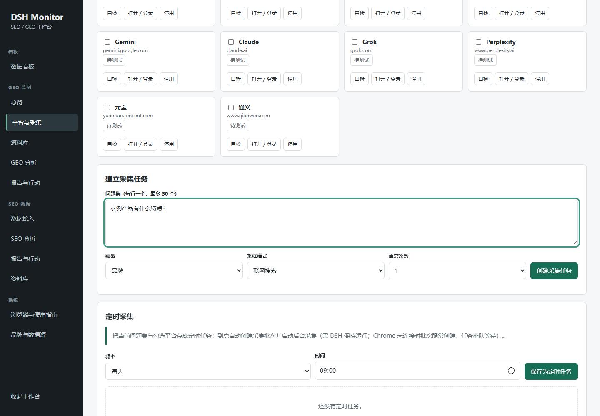
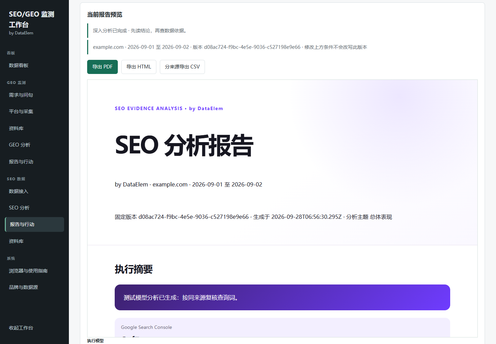

# SEO/GEO 监测工作台 0.14.1

DSH Desktop 工作台：采集 AI 网站回答、核对品牌证据、导入和分析 SEO 数据，生成可追溯的行动报告。

状态：0.14.1 已在本机真实环境验证并公开发布。仓库：https://github.com/gjz18342624299-arch/dsh-seo-geo-workbench ，许可证 MIT。工作台市场收录以 awesome-dsh-workbench 的收录 PR 审核为准，未合并前不宣称已上架。

## 界面

## 首次使用
1. 在 DSH 工作台管理中添加并打开本工作台，无需先创建会话。
2. 在“品牌与数据源”保存品牌名称、官网、别名；可配置所属公司、官方来源、同名实体和一般竞品。
3. 沿用 DSH 已配置的模型。浏览器采集需要用户安装随包扩展、配对并登录目标平台；先做一题自检再扩大批次。
4. 也可以先导入已有 CSV/XLSX/JSON/文本资料体验分析。
5. 首次需要会话时，使用 DSH 目录选择器确认资料位置。取消不创建会话；报告追问使用该报告专属、归属本工作台的原生会话。

新用户没有预填品牌。已有 DSH 品牌的数据保留旧规则；其他品牌只使用自身配置。首版一个数据空间对应一个品牌，已有历史时禁止直接改成另一个品牌。

## 安装与构建
市场版使用普通 npm 包契约，安装器负责依赖。客户端已构建为单文件，安装不执行构建脚本。不要使用旧 Windows ZIP 安装方式作为市场验收。

开发者命令（首次克隆后先执行 `cd vendor && npm ci` 恢复开发依赖；vendor/node_modules 不入库）：

    node sync-client.mjs
    node build.mjs
    node --test test/*.test.mjs
    node test/client-smoke.mjs
    node verify-package.mjs

标准 tgz 可通过 DSH 插件管理器安装：

    dsh plugin --profile web add /path/to/dsh-seo-geo-workbench-0.14.0.tgz --ignore-scripts

随后重启 Harness。官方宿主包使用 peerDependencies；xlsx 与 playwright-core 为普通运行依赖，不会自动下载浏览器。

## 数据与权限
新用户内部数据默认位于 dshHomePath('seo-geo-data')；包内不带业务数据。旧用户明确配置的数据位置保留。不要把数据目录设在插件安装目录。更新和卸载应保留会话、资料与报告。

浏览器扩展当前需要网页访问权限，操作采集标签页并保存回答、来源与截图；登录及验证码由用户处理。分析会向用户在 DSH 配置的模型发送所选资料，会产生该模型的相应用量。SEO 连接使用用户自行配置的数据源凭据。

注意：SEO 数据源凭据当前仍在本地业务状态中保存，系统安全存储迁移尚未完成；不要分享该状态文件、连接码、诊断原始日志或个人采样。发行包采用 files 白名单，排除 deployment.json、业务状态、测试资料及备份。

## 兼容性与验收边界
当前测试环境为 Windows x64，使用 DSH Desktop 0.10.0-test.20260927 随包 Harness 0.1.7-rc.2。隔离环境的标准包安装、配置合成、服务启动和页面检查分层记录，不能替代另一台新电脑的完整桌面验收。

Chrome 为原有采集环境；Edge 扩展和 Brave 尚待实际采集验收，Firefox/Safari 暂用资料导入。PDF 导出依赖系统 Edge，缺少时仍可导出 HTML。macOS/Linux 未验证。定时采集需要 DSH 与已连接浏览器运行。

发布状态：许可证 MIT，公开仓库与无敏感信息截图已就绪，发行包经 `node verify-package.mjs` 校验（入口齐全、无私有文件、体积达标）。仍待完善：SEO 数据源凭据的系统安全存储迁移；Edge 扩展与 Brave 的实际采集验收；macOS/Linux 未验证。市场可见性以收录目录为准。
